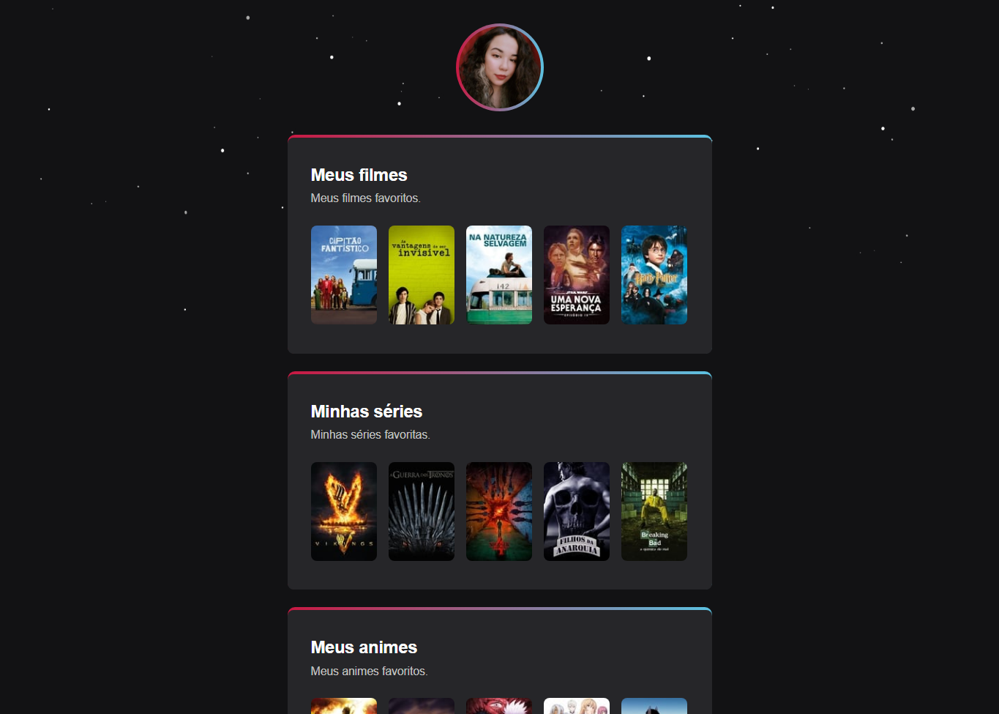

# Watch hub

## Objetivo do projeto
Criar um Watch hub: um site centralizador de links, no estilo Linktree, feito especialmente para pessoas que amam filmes e séries.

[🔗 É possível acessar o site clicando aqui! 💜](https://fernandadiasm.github.io/watch-hub/)

## 👩🏻‍💻 Techs
* HTML
* CSS

## 👤 Author

  

